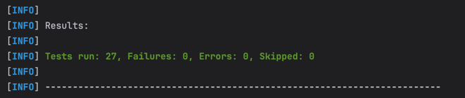

# Trade Processing Service

## How to Run the Service

1. **Configure Application Properties** (optional)
   Ensure you have the necessary configuration in  `application.yml`:
   ```properties
   app.batch-size=1000
   app.thread-count=5
   app.date-format=yyyyMMdd
   ```

2. **Build and Run the Application**
   ```sh
   mvn clean install
   mvn spring-boot:run
   ```

## How to Use the API

### Endpoint: Process Trades

- **URL:** `POST /process`
- **Headers:**
    - `Accept: text/csv | application/json | application/xml`
- **Request Parameters:**
    - `file`: A file containing trade data.
- **Example Request (cURL):**
  ```sh
   curl -X POST "http://localhost:8081/api/v1/process" \
        -H "Accept: text/csv" \
        -F "file=@src/main/resources/data-sample.csv" \
        -o output.csv
  ```
#### Precautions
If IDE/Postman is laggy, logs can be turned off (currently _on_ as it was needed by the task description).

## Design Discussion (implemented)

- **Strategy Design Pattern in Spring way i.e. pluggable import/export:**
    - Uses the `TradeImporter` and `TradeExporter` interfaces to allow different formats (CSV, JSON, XML) without
      breaking open/closed principle
- **Batch Processing:**
    - The service processes trades in batches to optimize performance and reduce memory usage.
    - Uses an `ExecutorService` to parallelize batch processing.

## Test results



## Implemented from optional section 
- Optional Enhancements: Support for JSON & XML 
- Optional Enhancements: Async Processing
  
## Ideas for Improvement

__Solution is designed and implemented with a great though put into finding balance between implementing and completing
the test task in a timely manner__

1. **Spring Web Flux:**
    - Can be used to make the trade processing service more reactive and memory-efficient
2. **Asynchronous Processing with Queues:**
    - Use Kafka or RabbitMQ to offload trade processing to a background worker.
3. **Better Error Handling:**
    - Provide a summary of skipped/invalid records in the API response/implement GlobalExceptionHandler
